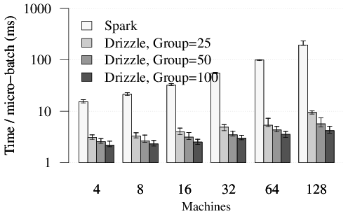

# Drizzle: Low Latency Execution for Apache Spark

Drizzle is a low latency execution engine for Apache Spark that is targeted
at stream processing and iterative workloads. Currently, Spark uses a BSP
computation model, and notifies the scheduler at the end of each task. Invoking
the scheduler at the end of each task adds overheads and results in decreased
throughput and increased latency.

In Drizzle, we introduce group scheduling, where multiple batches (or a group) of computation
are scheduled at once. This helps decouple the granularity of task execution from scheduling and
amortize the costs of task serialization and launch.

## Drizzle Example
The current Drizzle prototype exposes a low level API using the `runJobs` method in [SparkContext](core/src/main/scala/org/apache/spark/SparkContext.scala). This method takes in a
`Seq` of RDDs and corresponding functions to execute on these RDDs. Examples of using this API can be seen in [DrizzleSingleStageExample](examples/src/main/scala/org/apache/spark/examples/DrizzleSingleStageExample.scala) and [DrizzleRunningSum](examples/src/main/scala/org/apache/spark/examples/DrizzleRunningSum.scala).

To try out Drizzle locally, we first build Spark based on existing [instructions](http://spark.apache.org/docs/latest/building-spark.html). For example, using SBT we can run
```
  ./build/sbt package
```
We can run then run the `DrizzleRunningSum` example with 4 cores for 10 iterations with group size 10. Note that this example requires at least 4GB of memory on your machine.
```
  ./bin/run-example --master "local-cluster[4,1,1024]" org.apache.spark.examples.DrizzleRunningSum 10 10
```
To compare this with existing Spark, we can run the same 10 iterations but now with a group size of 1
```
  ./bin/run-example --master "local-cluster[4,1,1024]" org.apache.spark.examples.DrizzleRunningSum 10 1
```

The benefit from using Drizzle is more apparent on large clusters. Results from running the
single stage benchmark for 100 iterations on a
[Amazon EC2 cluster](spark.apache.org/docs/latest/ec2-scripts.html) of 128 machines is shown below.

<p style="text-align: center;">
  
</p>

## Status
The source code in this repository is a research prototype and only implements the scheduling techniques described in our paper.
The existing Spark unit tests pass with our changes and we are actively working on adding more tests for Drizzle.
We are also working towards a Spark JIRA to discuss integrating Drizzle with the Apache Spark project.

Finally we would like to note that extensions to integrate Structured Streaming and Spark ML will be implemented separately.

## For more details
For more details about the architecture of Drizzle please see our
[Spark Summit 2015 Talk](https://spark-summit.org/2016/events/low-latency-execution-for-apache-spark/)
and our [Technical Report](http://shivaram.org/drafts/drizzle.pdf)

## Acknowledgements
This is joint work with Aurojit Panda, Kay Ousterhout, Mike Franklin, Ali Ghodsi, Ben Recht and Ion
Stoica from the [AMPLab](http://amplab.cs.berkeley.edu) at UC Berkeley.
